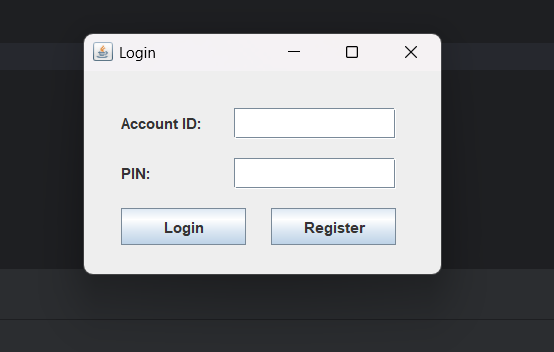
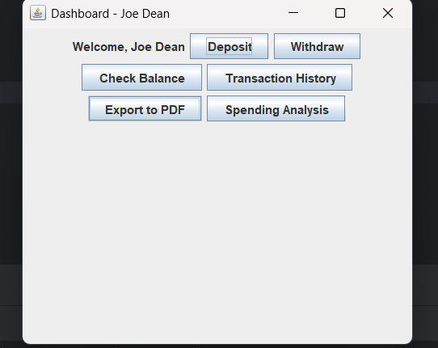
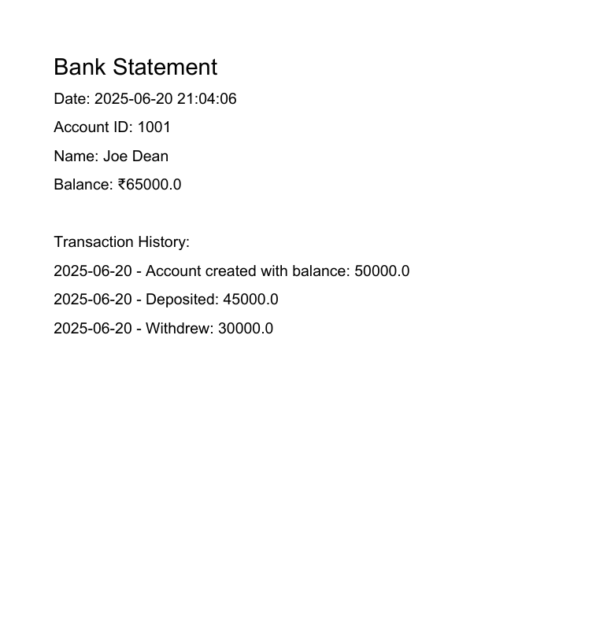

# Banking Management GUI App (Java Swing)

A simple Java-based GUI application for managing bank accounts — create users, deposit/withdraw funds, check balances, view transaction history, and export statements as PDF.

---

## Project Structure
```
BankingSystem/
├── screenshots/
│ ├── login.png
│ ├── dashboard.png
│ └── pdf_confirmation.png
├── src/
│ ├── bank/
│ │ ├── Account.java
│ │ └── Bank.java
│ └── ui/
│ ├── LoginFrame.java
│ ├── RegisterFrame.java
│ ├── TransactionFrame.java
│ └── DashboardFrame.java
├── README.md
└── output/
└── transactions_xxxx.pdf
```


---

## Features

- User Login & Secure Registration
- Deposit & Withdraw
- Transaction History Tracking
- PDF Export (via PDFBox)
- Organized Folder Structure
- Insufficient Funds Handling
- GUI built using Java Swing

---

## Screenshots

### Login Frame


### Dashboard


### PDF Confirmation


---

## Tech Stack

- Java 17
- Swing (GUI)
- PDFBox (PDF Generation)
- IntelliJ IDEA

---

## Future Add-ons (Optional)

- Password-Protected PDFs
- CSV Export
- Chart Visualization (Spending Patterns)
- Transaction Filters

---

## Author

Created by T Karthik Singh.

